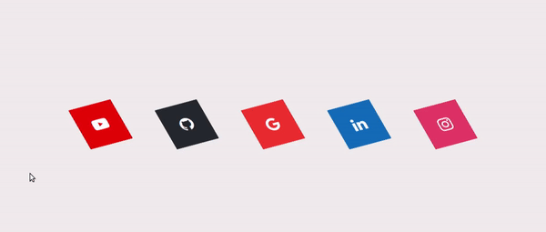
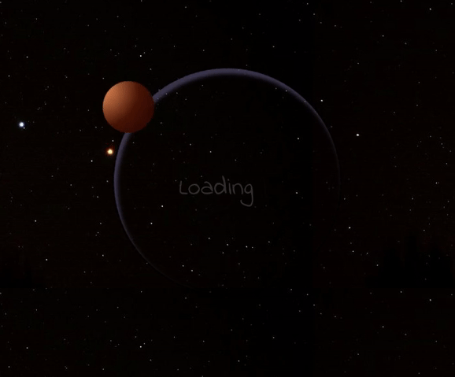

# :checkered_flag: Desafio 30 dias de CSS

## Índice

- [Dia 01 - Ícones de mídia social em camadas](#Dia-01---Ícones-de-mídia-social-em-camadas)
- [Dia 02 - Loader animado](#Dia-02---Loader-animado)

## :pushpin: Objetivo: 

Repositório destinado a armazenar todos os trinta mini projetos produzidos durante o desafio **#30diasCSS** proposto por [Milena Carecho](https://github.com/MilenaCarecho) que tem como objetivo melhorar as habilidades dos participantes em CSS3 e HTML5 . 

## Dia 01 - Ícones de mídia social em camadas

[Meu código](https://github.com/LeandraOliveiraS/Desafio30DaysCSS/tree/master/desafios/desafio1)

[Post Linkedin](https://www.linkedin.com/feed/update/urn:li:activity:6692575386414444544/)

### O que eu aprendi

- [X] Utilizar a tag `` para criar as camadas nos objetos.
- [x] Uso do `ntl-child()`

## Dia 02 - Loader animado

[Meu código](https://github.com/LeandraOliveiraS/Desafio30DaysCSS/tree/master/desafios/desafio2)

[Post Linkedin](https://www.linkedin.com/feed/update/urn:li:activity:6693405761990639616/)

### O que aprendi

**Obs:** Neste desafio, eu me prôpus a fazer um tipo de animação diferente. 
Utilizei várias animações de cores no planetinha (marte) e também para fazê-lo girar em órbita. Por isso, meus aprendizados foram em sua maioria 
em como:

- [X] Construir animações 2D e 3D.
- [X] Gerar degradê de cores, usando o `radial-gradient()`
- [X] Efeitos visuais diversos, com o `border`.

